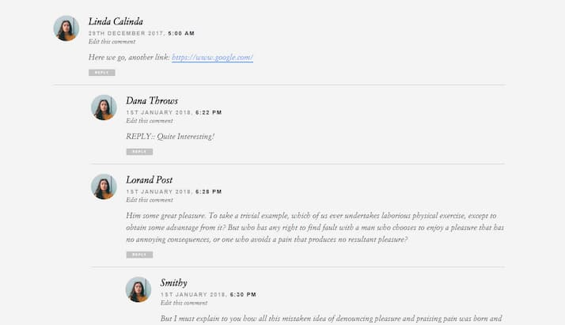

# comments-api-server-app

An application with comments and replies to comments. Captcha is used for verify users, to get captcha image use (/comments/captcha), the image is generated and sent to Front as Base64 along with the hash. There is a check for the validity of the fields.

BaseUrl - https://comments-a27j.onrender.com

- **<ins>API GET - /comments</ins>** -- get a list of comments with answers (by default 25 per page).
- **<ins>API GET - /comments/:id</ins>** -- get a list of replies to a comment by id (by default, 25 per page).
- **<ins>API POST - /comments</ins>** -- post a new main comment with
  username(3-12 symb), email, text, homepage(optional), captcha, hash.
- **<ins>API POST - /comments/:id</ins>** -- post a response to a comment with
  username(3-12 symb), email, text, homepage(optional), captcha, hash
- **<ins>API GET - /comments/captcha</ins>** -- get image(base64) and hash to verify.

Stack - NodeJs, Typescript, PostgreSql, TypeORM, Express.
